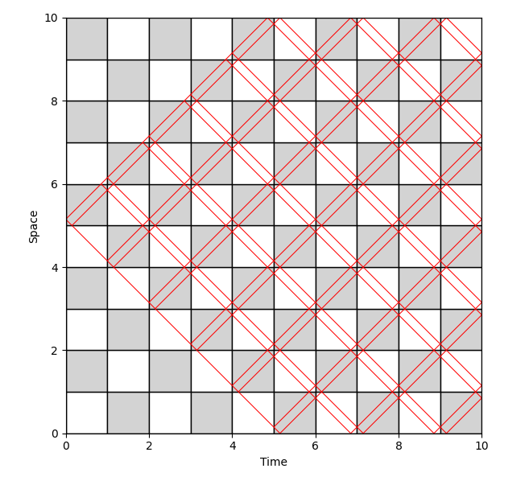
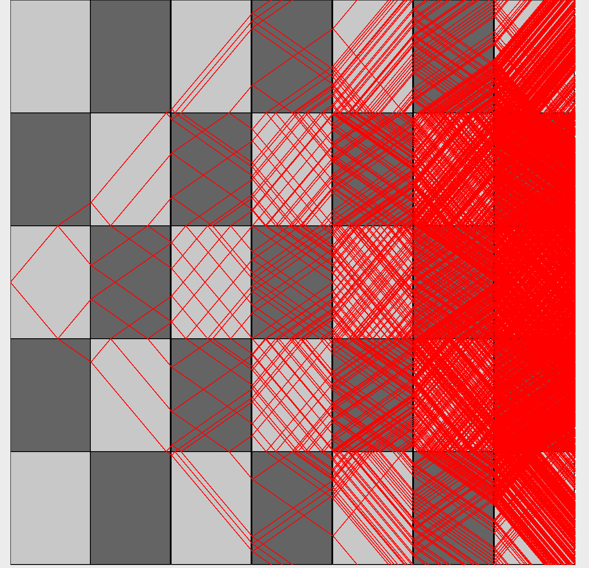
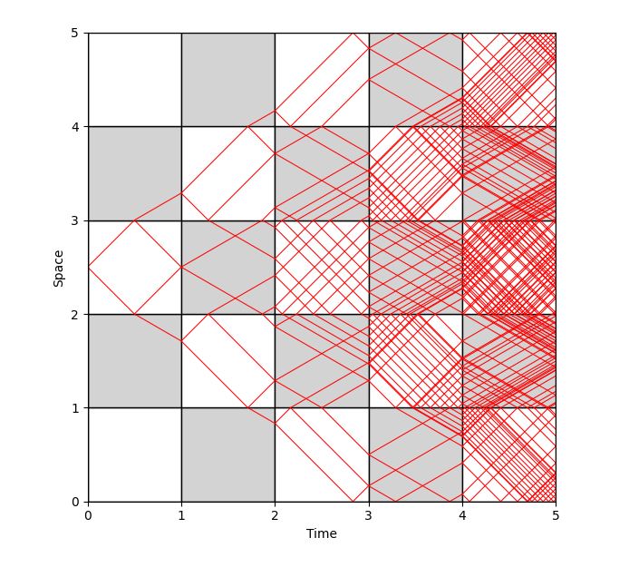

# To run :
```bash
pip install matplotlib numpy
python graph.py 
```
  

Python script to create an interactive visualization of a recursive vector reflection pattern on a checkerboard grid. Developed for use at the University of Utah Math Department for research for iteration on ideas first found [here](https://arxiv.org/abs/1705.00539). 

Script visualizes how waves propogate through different gradients and allow users to quickly identify whether the waves growth is bounded or not. 

Visual Example of a Bounded Growth Wave :



Visual Example of an Unbounded Growth Wave : 



